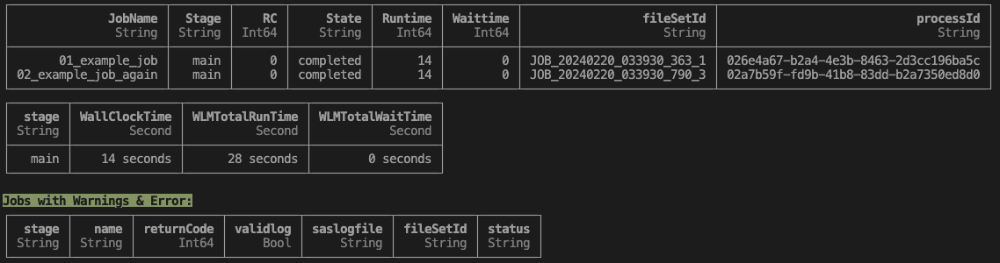

<h1>README</h1>
This repo allows batch jobs to sent to SAS Studio.

<h2>Usage</h2>

Place .sas code in `/assets/workloads` \
It is recommended to use the following structure

ViyaBatchJobs.jl \
|--assets \
&emsp;  |--workloads \
&emsp; &emsp;  |--workloads \
&emsp; &emsp; &emsp;  |-- {name-of-workload} \
&emsp; &emsp; &emsp; &emsp;  |-- code \
&emsp; &emsp; &emsp; &emsp;  |-- data \
&emsp; &emsp; &emsp; &emsp;  |-- autoexec.sas \
&emsp; &emsp; &emsp; &emsp;  |-- {sas-file}.toml \
&emsp; &emsp; &emsp; &emsp;  |-- README.md

* Name of workload - name of your workload/tests
* Code - Where you place your SAS files (what you'd run in SAS Studio)
* Data - Scripts and assets which your SAS files may depend on
* Toml files - Config files that prescribe the stages and jobs where your SAS files will be run (more on this in toml-README.md)
* autoexec.sas - SAS config [files](https://go.documentation.sas.com/doc/en/pgmsascdc/9.4_3.5/hosto390/n16cfsauaono3bn1syrk9rmjsv5s.htm) that are auto executed immediately upon initialization before running any SAS code

<h2>Pre-requisites</h2>

1. npm or npx
2. [Julia](https://julialang.org/downloads/)
3. [sas-viya-cli](https://support.sas.com/downloads/package.htm?pid=2512) \
    i. [Instructions](https://go.documentation.sas.com/doc/en/sasadmincdc/v_049/calcli/n1e2dehluji7jon1gk69yggc6i28.htm)

<h2>Additional Requirements</h2>
Upon first setting up / installation of directory, you'll need the following:

1. Install [julia](https://julialang.org/downloads/)
2. Install `sas-viya` and send to `/bin` \
    i. Install `batch` plugin by running `sas-viya plugins install --repo SAS batch` \
    ii. Authenticate - `sas-viya -k auth loginCode` \
3. Go to the directory ~/ViyaBatchJobs.jl \
    i. Run `julia --project=@.` \
    ii. Then type `]` to get t o the package management and run `instantiate` which will download dependencies

<h3>Happy Path Example!</h3>
Note that this example is within the `assets/workloads` folder in this repository.

1. Create a working directory for your workload under `assets/workloads`, for this example we'll call it `goldfish`
2. Within `assets/workloads/goldfish`, create the following files: \
    i. ExampleSASProgram.sas - essentially reads a CSV file and prints cell A2 \
    ii. TempExample.csv \
    iii. goldfish.toml - is a config file that prescribes the jobs that should be run and how they should be run \
    iv. autoexec.sas - a config file that contains SAS statements and is executed automatically when you run/invoke SAS processes
3. Few critical things to note: \
    i. You must have sas-viya-cli installed + on your path (e.g. put in /usr/bin) \
    ii. `viyacli_path` within `goldfish.toml` must point to it \
    iii. The csv file must live in a location that is accessible to your Viya deployment, if you're using a typical DAC deployment, the path is under the [`JUMP_SVR_RWX_FILESTORE_PATH`](https://github.com/sassoftware/viya4-deployment/blob/main/docs/CONFIG-VARS.md#jump-server) key
    iv. In this example, the `autoexec.sas` also contains an output directory `/mnt/viya-share/data/workdir`
3. Run your workload from the root ViyaBatch folder, `.../ViyaBatchJobs.jl` using `./runworkload.jl --insecure --workdir output/ assets/workloads/goldfish/goldfish.toml`
4. if it ran successfully, you'll see a similar output to this.

    Any non-zero number under the column, "RC Int64" is an error. \
    Logs and outputs can be viewed in the `ViyaBatchjobs.jl/output` folder